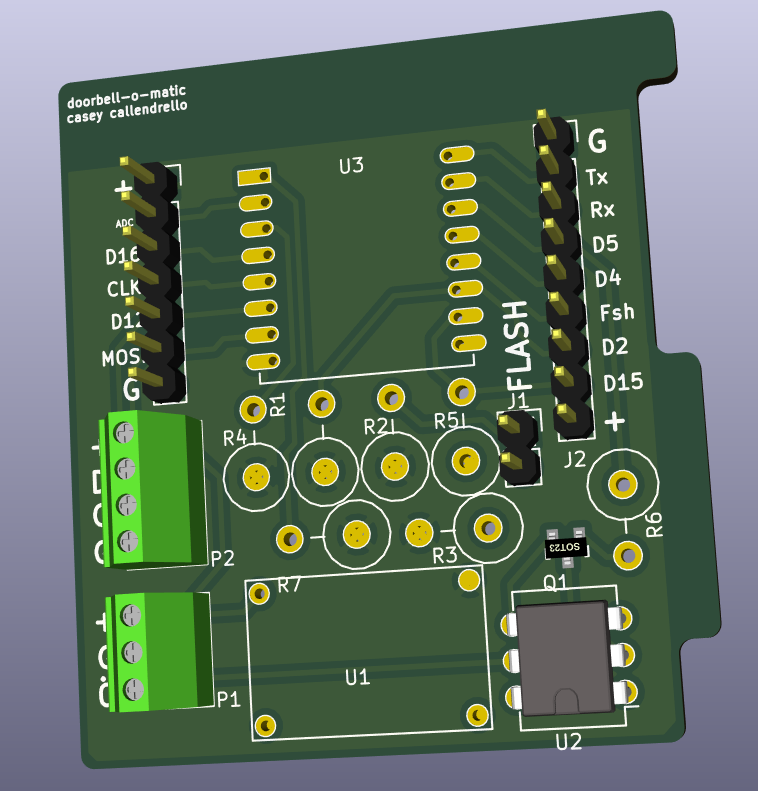
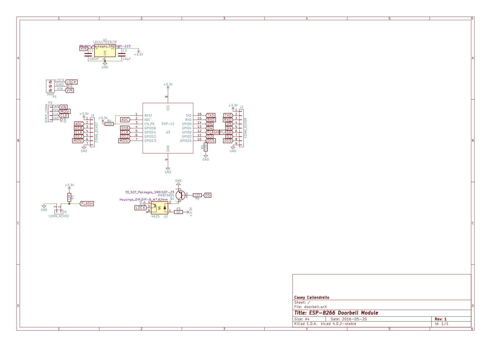

ESP8266 to Doorbell adapter
===========================

This is a simple PCB that connects an ESP-8266 with a Ritto 6630 door opener. This
sort of hardware is typically used in German apartment buildings. The circuit allows
the front door to be opened via an ESP8266.

This particular telephone has slots for multiple modules within the chassis. This board
is designed to fit in that slot.

The telephone opens the door by tying the Opener signal to Ground. So, this board
provides an optoisolator that simulates pressing the button. The opener signal
is somewhere around 8v, and draws about 12mA when grounded. It needs at least a
transistor for protection, but I'm interfacing via an optocoupler.

Since the system also supplies a 12v power rail, we use that too.

This also exposes the SPI lines to connect an LED strip, because those are useful.
The goal is to someday expose BVG timing on them.

